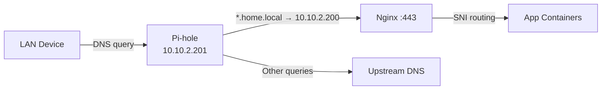

# 🚀 Home Server — System & Network Design

A self-hosted home server running on a mini PC (Ubuntu Linux) with Docker Compose. The system provides media streaming, file storage, photo management, automation, DNS ad-blocking, and remote access — all behind a local HTTPS reverse proxy.

---

## 📐 Architecture Overview

```
┌─────────────────────────────────────────────────────────────────────────┐
│  Mini PC  (Ubuntu Linux · 10.10.2.200)                                  │
│                                                                         │
│  ┌─────────────────────────────────────────────────────────────────┐    │
│  │  Docker Engine                                                  │    │
│  │                                                                 │    │
│  │  ┌─────────────┐   ┌────────────────────────────────────────┐   │    │
│  │  │  macvlan_net │   │  proxy_net (bridge)                   │   │    │
│  │  │             │   │                                        │   │    │
│  │  │  Pi-hole    │   │  Nginx (:80/:443)                      │   │    │
│  │  │  .201       │   │    ├── Dashy        ├── Jellyfin       │   │    │
│  │  └─────────────┘   │    ├── VSCode       ├── qBittorrent    │   │    │
│  │                     │    ├── Portainer    ├── Immich         │   │    │
│  │                     │    ├── Glances      ├── Filebrowser    │   │    │
│  │                     │    └── Nextcloud                       │   │    │
│  │                     └────────────────────────────────────────┘   │    │
│  │                                                                 │    │
│  │  ┌──────────────┐  ┌──────────────┐  ┌──────────────────────┐  │    │
│  │  │ monitor_net  │  │  immich_net  │  │   nextcloud_net      │  │    │
│  │  │ DockerProxy  │  │  Redis       │  │   MySQL 8.0          │  │    │
│  │  │ Portainer    │  │  PostgreSQL  │  └──────────────────────┘  │    │
│  │  │ Glances      │  │  ML (OpenVINO)│                           │    │
│  │  └──────────────┘  └──────────────┘                            │    │
│  │                                                                 │    │
│  │  ── Access Stack (separate lifecycle) ──────────────────────    │    │
│  │  Twingate Connector (host network)                              │    │
│  │  n8n ←→ Tailscale sidecar (ts-n8n)                             │    │
│  │  OpenClaw ←→ Tailscale sidecar (ts-openclaw)                   │    │
│  └─────────────────────────────────────────────────────────────────┘    │
│                                                                         │
│  Storage:                                                               │
│    /home/docker-volumes/  ── service configs & databases                │
│    /mnt/mediahdd/         ── media, photos, downloads (ext4 USB HDD)    │
└─────────────────────────────────────────────────────────────────────────┘
```

---

## 🌐 Network Design

### Subnet & IPs

| Role | IP / Range |
|------|-----------|
| LAN subnet | `10.10.2.0/24` |
| Gateway | `10.10.2.1` |
| Server (host) | `10.10.2.200` |
| Pi-hole (macvlan) | `10.10.2.201` |
| macvlan parent | `eno2` |

### Docker Networks

| Network | Driver | Purpose |
|---------|--------|---------|
| `macvlan_net` | macvlan | Gives Pi-hole its own LAN IP so it can serve as the network DNS |
| `proxy_net` | bridge | Connects all web-facing services to the Nginx reverse proxy |
| `monitor_network` | bridge | Isolates Docker socket proxy, Portainer, and Glances |
| `immich_net` | bridge | Private network for Immich, Redis, PostgreSQL, and ML |
| `nextcloud_net` | bridge | Private network for Nextcloud and its MySQL database |

### DNS & Routing Flow



All `*.home.local` A records are managed in `pihole/dnsmasq.d/05-home-local.conf` and resolve to the server IP. Router DHCP is configured to hand out Pi-hole as the DNS server.

### Remote Access

| Method | Scope |
|--------|-------|
| **Twingate** | Zero-trust connector on host network — reaches any LAN service |
| **Tailscale Funnel** | Exposes n8n (port 5678) and OpenClaw (port 18789) to the internet via Tailscale |

The access stack (`docker-compose.access.yml`) is kept separate so remote access remains up during app-stack maintenance.

#### Twingate Setup

The Twingate connector runs on the host and resolves DNS locally. Since the host cannot reach Pi-hole on macvlan directly, `*.home.local` entries are added to `/etc/hosts` on the server:

```
10.10.2.200 home.local dashy.home.local vscode.home.local portainer.home.local glances.home.local nextcloud.home.local jellyfin.home.local qbittorrent.home.local immich.home.local files.home.local
```

##### Twingate Resources

Add the following Resources in the Twingate admin console (all assigned to the home Remote Network):

| Resource | Address | Purpose |
|----------|---------|---------|
| All home services | `*.home.local` | All reverse-proxied services (Dashy, Jellyfin, VSCode, etc.) |
| Pi-hole Admin | `10.10.2.201` | Pi-hole DNS management UI |
| TP-Link Router | `10.10.2.1` | Main LAN router admin panel |
| TP-Link Root Router | `10.10.1.1` | Root/upstream router admin panel |
| Server direct | `10.10.2.200` | Direct server access (SSH, Nginx, etc.) |

##### How it works

1. Twingate client on remote device intercepts traffic to matched resources
2. Traffic is routed to the Twingate connector on the server host
3. Connector resolves `*.home.local` via `/etc/hosts` → `10.10.2.200`
4. Connector routes IP-based resources directly (Pi-hole, routers)
5. Nginx terminates TLS and proxies to the correct container

##### Remote device setup

1. Install Twingate client and sign in
2. Download CA cert: `https://home.local/ca/home-local-ca.crt`
3. Trust the CA certificate in your OS/browser (see TLS section below)

> **Note:** The `*.home.local` wildcard covers all current and future subdomains. When onboarding a new service, just add it to `/etc/hosts` on the server — no Twingate changes needed.

---

## 🔒 TLS (Local CA)

A private Certificate Authority issues certs for `*.home.local`:

```
nginx/ca/home-local-ca.crt    ← CA root (trust on devices once)
nginx/certs/home.local.crt    ← Leaf cert (auto-renewed)
nginx/certs/home.local.key    ← Private key
```

Scripts:

| Script | Purpose |
|--------|---------|
| `scripts/tls/create-local-ca.sh` | One-time CA creation |
| `scripts/tls/issue-home-local-cert.sh` | Issue leaf cert + reload Nginx |
| `scripts/tls/renew-home-local-cert.sh` | Renew leaf cert (cron-friendly) |

Trust the CA on each device by downloading `https://home.local/ca/home-local-ca.crt` (or `http://10.10.2.200/ca/home-local-ca.crt` before trust is set up) and verifying the SHA-256 fingerprint:

```bash
openssl x509 -in nginx/ca/home-local-ca.crt -noout -fingerprint -sha256
```

**Per-platform installation:**

| Platform | Steps |
|----------|-------|
| **Windows** | Double-click `.crt` → Install Certificate → Local Machine → Trusted Root Certification Authorities |
| **macOS** | Double-click → Keychain Access → Trust → Always Trust |
| **Linux** | `sudo cp home-local-ca.crt /usr/local/share/ca-certificates/ && sudo update-ca-certificates` |
| **iOS** | Open in Safari → Install Profile → Settings → General → About → Certificate Trust Settings → Enable |
| **Android** | Settings → Security → Install a certificate → CA certificate |
| **Firefox** | Settings → Privacy & Security → Certificates → View Certificates → Import |

---

## 🐳 Services

### Main Stack (`docker-compose.yml` — project `jay-home-base`)

| Service | Image | Network | Description |
|---------|-------|---------|-------------|
| **Nginx** | `nginx:1.27-alpine` | proxy_net | HTTPS reverse proxy for all web apps |
| **Pi-hole** | `pihole/pihole` | macvlan_net, monitor | Network-wide DNS + ad blocker |
| **Dashy** | `lissy93/dashy` | proxy_net | Server dashboard / homepage |
| **VSCode** | `coder/code-server` | proxy_net | Web-based IDE |
| **Portainer** | `portainer-ce:lts` | monitor, proxy_net | Docker management UI (via socket proxy) |
| **Docker Proxy** | `tecnativa/docker-socket-proxy` | monitor | Secure Docker socket access |
| **Glances** | `nicolargo/glances` | monitor, proxy_net | System monitoring |
| **Nextcloud** | `nextcloud` | nextcloud_net, proxy_net | Self-hosted file sync & share |
| **Nextcloud DB** | `mysql:8.0` | nextcloud_net | MySQL for Nextcloud |
| **Jellyfin** | `jellyfin/jellyfin` | proxy_net | Media streaming server |
| **qBittorrent** | `linuxserver/qbittorrent` | proxy_net | Torrent client |
| **Immich** | `immich-server` | immich_net, monitor, proxy_net | Photo/video management |
| **Immich ML** | `immich-machine-learning` | immich_net | AI-powered photo features (OpenVINO accelerated) |
| **Redis** | `valkey:9` | immich_net | Cache for Immich |
| **PostgreSQL** | `immich postgres:14` | immich_net | Database for Immich |
| **Filebrowser** | `filebrowser/filebrowser` | proxy_net | Web file manager for media library |

### Access Stack (`docker-compose.access.yml` — project `jay-home-access`)

| Service | Image | Network | Description |
|---------|-------|---------|-------------|
| **Twingate** | `twingate/connector:1` | host | Zero-trust network connector |
| **ts-n8n** | `tailscale/tailscale` | (sidecar) | Tailscale node for n8n |
| **n8n** | `n8nio/n8n` | shares ts-n8n network | Workflow automation |
| **ts-openclaw** | `tailscale/tailscale` | (sidecar) | Tailscale node for OpenClaw |
| **OpenClaw** | `openclaw/openclaw` | shares ts-openclaw network | AI gateway |

---

## 🌍 Service URLs

| Service | URL |
|---------|-----|
| Home (redirects to Dashy) | `https://home.local` |
| Dashy | `https://dashy.home.local` |
| VSCode | `https://vscode.home.local` |
| Portainer | `https://portainer.home.local` |
| Glances | `https://glances.home.local` |
| Nextcloud | `https://nextcloud.home.local` |
| Jellyfin | `https://jellyfin.home.local` |
| qBittorrent | `https://qbittorrent.home.local` |
| Immich | `https://immich.home.local` |
| Filebrowser | `https://files.home.local` |
| Pi-hole Admin | `http://10.10.2.201/admin` |
| n8n (Tailscale) | Via Tailscale Funnel |

---

## 💾 Storage Layout

```
/home/docker-volumes/          ← Service configs & databases
├── pihole/
├── dashy/
├── portainer/
├── glances/
├── nextcloud/ (html + db)
├── jellyfin/ (config + cache)
├── qbittorrent/
├── immich/postgres
├── filebrowser/
├── n8n/
├── openclaw/
├── tailscale-n8n/
└── tailscale-openclaw/

/mnt/mediahdd/                 ← USB HDD (ext4, UUID-mounted)
├── jellyfin/                  ← Media library
├── downloads/                 ← qBittorrent downloads
├── immich/                    ← Photo uploads + model cache
└── nextcloud_data/            ← Nextcloud user files
```

**fstab entry (UUID-based, boot-safe):**

```
UUID=c8936447-af37-4cf1-9142-64e7e2873ea4  /mnt/mediahdd  ext4  defaults,nofail,x-systemd.device-timeout=10s  0  2
```

---

## 🚀 Setup Guide

### 1. Install Docker & Compose Plugin

```bash
sudo apt-get update
sudo apt-get install ca-certificates curl gnupg -y
sudo install -m 0755 -d /etc/apt/keyrings
curl -fsSL https://download.docker.com/linux/ubuntu/gpg | sudo gpg --dearmor -o /etc/apt/keyrings/docker.gpg
echo "deb [arch=$(dpkg --print-architecture) signed-by=/etc/apt/keyrings/docker.gpg] \
  https://download.docker.com/linux/ubuntu $(lsb_release -cs) stable" | \
  sudo tee /etc/apt/sources.list.d/docker.list > /dev/null
sudo apt-get update
sudo apt-get install docker-ce docker-ce-cli containerd.io docker-compose-plugin -y
```

### 2. Mount the Media HDD

```bash
sudo mkdir -p /mnt/mediahdd
# Add UUID line to /etc/fstab (see Storage Layout above)
sudo mount -a
```

### 3. Prepare Service Directories

```bash
sudo bash ./scripts/setup/prepare-service-paths.sh
```

Ownership defaults:

| Scope | Owner | Mode |
|-------|-------|------|
| App data | `1000:1000` | `775` |
| Nextcloud DB (MySQL) | `999:999` | `750` |
| Nextcloud app/data | `33:33` | `750` |
| Immich Postgres | `1000:1000` | `775` |
| Tailscale state | `root:root` | `700` |

### 4. Configure Environment

Copy `.env.example` to `.env` and fill in secrets (passwords, tokens, auth keys).

### 5. Create Local CA & Certs

```bash
bash ./scripts/tls/create-local-ca.sh
bash ./scripts/tls/issue-home-local-cert.sh --reload
```

### 6. Start the Stacks

```bash
# Access stack first (keeps remote access alive during app maintenance)
docker compose -f docker-compose.access.yml up -d

# Main application stack
docker compose -f docker-compose.yml up -d
```

---

## 🧯 Operations

### Safe Stop/Update

```bash
# Stop only app stack (remote access stays up)
docker compose -f docker-compose.yml down

# Stop only access stack
docker compose -f docker-compose.access.yml down
```

### Cert Renewal (weekly cron)

```bash
0 3 * * 0 cd /path/to/linux-server && bash ./scripts/tls/renew-home-local-cert.sh >> /var/log/home-local-cert-renew.log 2>&1
```

### Pi-hole Password Reset

```bash
sudo docker exec -it pihole pihole setpassword
```

### VSCode Git Ownership Fix

```bash
sudo chown -R 1000:1000 /mnt/mediahdd/vscode/projects/.git
```

### HDD Troubleshooting

```bash
lsblk                              # Check connected drives
sudo mount /dev/sdb2 /mnt/mediahdd # Manual mount if needed
sudo hdparm -S 0 /dev/sdb          # Disable spin-down
```

---

## 🔄 Backup Procedure

```bash
# Mount backup drive
sudo mount /dev/sdc1 /mnt/hdd
sudo mkdir -p /mnt/hdd/mediahdd-backup

# Sync media and docker volumes (incremental after first run)
sudo rsync -avh --progress /mnt/mediahdd/ /mnt/hdd/mediahdd-backup/
sudo rsync -avh --progress /home/docker-volumes /mnt/hdd/docker-volumes/

# Verify
ls /mnt/hdd/mediahdd-backup
```

---

## 💻 Git Configuration

```bash
git config --global user.name "Jayasuriyan RP"
git config --global user.email "r.p.jayasuriyanece@outlook.com"
```

---

## ⚠️ Known Issues & Troubleshooting

### Pi-hole v6: dnsmasq.d configs not loaded

Pi-hole v6 (FTL-based) does **not** read `/etc/dnsmasq.d/` by default. The setting must be explicitly enabled:

```bash
docker exec pihole pihole-FTL --config misc.etc_dnsmasq_d true
docker exec pihole pihole reloaddns
```

This is also set declaratively in `docker-compose.yml` via the environment variable:

```yaml
FTLCONF_misc_etc_dnsmasq_d: "true"
```

### Host cannot reach Pi-hole on macvlan

Docker macvlan containers are isolated from the host by design. The host machine **cannot** communicate with Pi-hole at `10.10.2.201` directly. Workarounds:

- Use `/etc/hosts` on the host for `*.home.local` resolution (needed for Twingate) ← **current approach**
- Or create a macvlan shim interface (fragile, requires systemd service)

> **Approach tried & abandoned — Bridge mode Pi-hole:**
>
> We attempted moving Pi-hole off macvlan to a bridge network with published ports (`53:53`, `8053:80`) so the host could resolve DNS directly. This required disabling `systemd-resolved` to free port 53. While Pi-hole worked, LAN devices failed to resolve because the router was handing out DNS via IPv6 Router Advertisement (RDNSS) which overrode the DHCP setting. Reverting to macvlan + `/etc/hosts` was more reliable with the existing router configuration.

### Host DNS resolution (`/etc/resolv.conf`)

The host uses `systemd-resolved` (stub at `127.0.0.53`). Since the host **cannot** reach Pi-hole on macvlan, it relies on upstream DNS for external resolution. If `systemd-resolved` loses its upstream (e.g., after a restart), the host may fail to resolve external domains (like `github.com`).

**Fix if external DNS breaks:**

```bash
sudo rm /etc/resolv.conf
echo "nameserver 1.1.1.1" | sudo tee /etc/resolv.conf
echo "nameserver 8.8.8.8" | sudo tee -a /etc/resolv.conf
```

**Permanent fix** — configure upstream DNS in resolved.conf:

```bash
sudo sed -i '/\[Resolve\]/a DNS=1.1.1.1 8.8.8.8' /etc/systemd/resolved.conf
sudo systemctl restart systemd-resolved
sudo ln -sf /run/systemd/resolve/stub-resolv.conf /etc/resolv.conf
```

### Devices not resolving `*.home.local`

1. Ensure router DHCP hands out `10.10.2.201` (Pi-hole) as the DNS server
2. Flush DNS and renew DHCP lease on the device:
   - **Windows:** `ipconfig /flushdns && ipconfig /release && ipconfig /renew`
   - **macOS:** `sudo dscacheutil -flushcache` + reconnect Wi-Fi
   - **iPhone/Android:** Toggle Wi-Fi off/on or "Renew Lease"
3. Check for IPv6 DNS (Router Advertisement) overriding the DHCP setting — disable RDNSS/IPv6 RA DNS in the router if needed

### TLS certificate not trusted on iOS

After downloading the CA cert, iOS requires two steps:

1. **Install profile:** Settings → General → VPN & Device Management → Install the profile
2. **Enable trust:** Settings → General → About → Certificate Trust Settings → Toggle ON for the CA

### Verify DNS resolution

```bash
# From server (inside Pi-hole)
docker exec pihole dig dashy.home.local @127.0.0.1 +short

# From any LAN device (query Pi-hole directly)
nslookup dashy.home.local 10.10.2.201

# From server host (uses /etc/hosts)
getent hosts dashy.home.local
```

### Adding a new service

When adding a new service to the stack, use the helper script:

```bash
sudo bash scripts/dns/add-service-dns.sh <subdomain> [port] [--reload]

# Example: add grafana.home.local with container port 3000
sudo bash scripts/dns/add-service-dns.sh grafana 3000 --reload
```

The script automatically:
1. Adds DNS record to `pihole/dnsmasq.d/05-home-local.conf`
2. Adds `/etc/hosts` entry on the server (for Twingate/host resolution)
3. Optionally reloads Pi-hole

**Manual steps after running the script:**
4. Add Nginx server block to `nginx/conf.d/home-server.conf`
5. Add the FQDN to the HTTP→HTTPS redirect `server_name` list in Nginx
6. Reload Nginx: `docker exec nginx-proxy nginx -s reload`
7. (Optional) Add entry to `dashy/conf.yaml`

---

## Immich recovery notes (2026-05-01)

Summary of issues encountered:
- Portainer failed to show containers due to endpoint/socket mismatch (Portainer expected unix socket).
- Nginx returned 502 for `https://immich.home.local` due to upstream host mismatch (`immich_server` vs service name).
- Immich Postgres container repeatedly restarted because the existing DB directory was initialized by PostgreSQL 15 while the image was PostgreSQL 14.

Fixes and commands applied:
1. Restored Portainer socket mount to allow older persisted unix-socket endpoints to work:
   - Edit `docker-compose.yml` and add under `portainer.volumes`:
     `- /var/run/docker.sock:/var/run/docker.sock:ro`
   - Then apply: `docker compose up -d portainer` and `docker compose restart portainer`

2. Fixed Nginx upstream for Immich (use Docker service name):
   - Update `nginx/conf.d/home-server.conf`:
     `proxy_pass http://immich-server:2283;`
   - Reload Nginx: `docker compose exec nginx nginx -s reload` or `docker compose up -d nginx`

3. Reset only Immich Postgres data (keep media intact) because data dir was incompatible:
   - Stop services: `docker compose stop immich-server database redis immich-machine-learning`
   - Confirm mounted DB path: `docker inspect immich_postgres --format '{{range .Mounts}}{{println .Source "->" .Destination}}{{end}}'`
   - Remove DB files (delete contents, not the directory):
     `sudo find /home/docker-volumes/immich/postgres -mindepth 1 -delete`
   - Ensure correct permissions for Postgres (container expects UID 999):
     `sudo chown -R 999:999 /home/docker-volumes/immich/postgres`
     `sudo chmod 700 /home/docker-volumes/immich/postgres`
   - Start fresh DB and services:
     `docker compose up -d database redis immich-machine-learning immich-server`

4. Reuse existing media without copying by mounting it as an external path and scanning:
   - In `docker-compose.yml` (immich-server.volumes) add a read-only mount mapping the host media to a new container path, e.g.:
     `- /mnt/mediahdd/immich/library:/external/library:ro`
   - Restart immich-server: `docker compose up -d immich-server`
   - In Immich UI: Administration → External Libraries → Add `/external/library` → Scan library

Notes & cautions:
- Do NOT delete `/mnt/mediahdd/immich` — that contains your media and should be preserved.
- If `.env` contains unquoted values with spaces (e.g., `NEXTCLOUD_TRUSTED_DOMAINS`), avoid using `source .env`; instead extract values with `grep`/`cut`.
- If Postgres data was created by a newer major version, either reinitialize data (as done above) or run a proper major-version upgrade outside the container.


## Maintenance & Troubleshooting

### Routine File Cleanup and Scan
If you encounter issues with file indexing or template inconsistencies, run the following sequence:

1. **Clear merged templates:**
   ```bash
   docker compose exec --user root nextcloud bash -lc 'find /var/www/html/data -name "merged-template*" -delete'
   ```

2. **Run maintenance repair:**
   ```bash
   docker compose exec --user www-data nextcloud php /var/www/html/occ maintenance:repair
   ```

3. **Force a full file system scan:**
   ```bash
   docker compose exec --user www-data nextcloud php /var/www/html/occ files:scan --all
   ```

### Restarting the Service
To apply changes or refresh the container environment:
```bash
docker compose down nextcloud
docker compose up nextcloud -d
```
